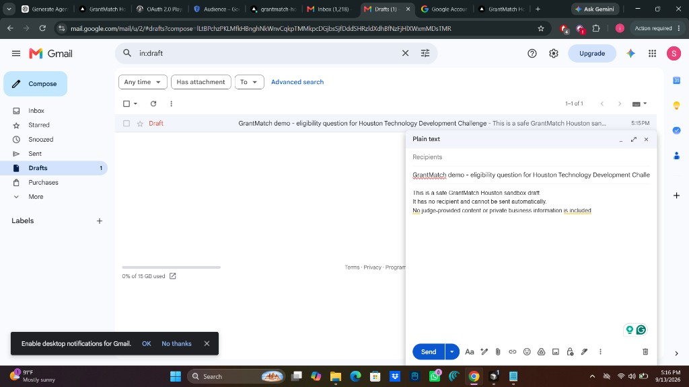

# GrantMatch Houston

**Funding intelligence for early-stage Houston founders—turning a business
profile into explainable funding matches and an application-ready plan.**

- **Live demo:** [grantmatch-houston.vercel.app](https://grantmatch-houston.vercel.app/)
- **Repository:** [`irum13/grantmatch-houston`](https://github.com/irum13/grantmatch-houston)

## The Problem

Founders must search across grants, competitions, accelerator programs, local
initiatives, and government sources. Requirements, permitted uses, deadlines,
and application materials are fragmented and frequently change.

A database search can return opportunities, but it does not answer the harder
questions: **Am I eligible? Is this a good use of my time? What evidence am I
missing? What should I do next?**

## What GrantMatch Does

GrantMatch turns funding discovery into a guided decision workflow:

```text
Founder profile
  → understand the funding need
  → find relevant opportunities
  → evaluate eligibility, fit, and readiness
  → explain matches and blockers
  → identify evidence and document gaps
  → create an application action plan
  → execute the next approved step
```

## What Makes It Different

- **Eligibility, fit, and readiness are separate.** A founder can qualify for a
  program without it being the right funding source—or be eligible but not
  ready to apply.
- **Recommendations are explainable.** Every result connects requirements to
  founder evidence and keeps the official source visible.
- **“Why not?” is as important as “why.”** Ruled-out opportunities show hard
  blockers and facts that still need verification.
- **Results become action plans.** Missing documents, outreach, and deadlines
  become practical next steps instead of another list of links.
- **AI assists understanding; rules protect consistency.** AI structures
  founder information while deterministic logic handles matching and
  eligibility checks wherever possible.

## Try the Demo

The complete judge journey works without creating an account:

1. Open the **[live demo](https://grantmatch-houston.vercel.app/)** and choose
   **Try the demo**.
2. Select the **AI Healthcare** scenario
   (**HoustonAI Health / CareSight AI**), then analyze its seeded documents.
3. Review ranked matches, evidence, readiness, and “Why not?” explanations.
4. Change the requested amount or funding purpose and observe the
   recommendations change.
5. Open a match and generate its application action plan.

Demo founders, documents, and demo-only opportunities are fictional and visibly
labelled. Public funding resources retain their official source links.

## Live Integrations

The deployed demo includes a verified live Gmail action. After confirmation,
GrantMatch can create a fixed, unsent, recipient-free draft in a dedicated
project demo account. It never sends the message or accepts a judge-provided
recipient.



*Live Gmail integration: GrantMatch created an unsent draft in the project demo
account.*

This screenshot is evidence captured from the live deployed demo, not a mockup.
Google Drive and Calendar have OAuth and safe-action architecture in the
project, but are not presented here as verified live demo integrations.

## Technical Architecture

- **Next.js, React, and TypeScript:** responsive application and server routes
- **Supabase:** optional structured opportunity persistence with row-level
  security
- **AI-assisted understanding:** structures founder descriptions and evidence,
  with a conservative heuristic fallback
- **Deterministic matching:** scores eligibility, practical fit, and
  application readiness
- **Grants.gov Search2:** adds live federal opportunity discovery
- **Google integration architecture:** incremental OAuth for selected Drive
  files, unsent Gmail drafts, and Calendar events
- **Vercel:** production deployment and server-side secret handling

```text
Founder input + selected evidence
              ↓
    Structured founder profile
              ↓
Deterministic eligibility / fit / readiness
              ↓
Curated Houston/Texas data + Grants.gov
              ↓
Explanations → gaps → action plan → approved integrations
```

The Supabase schema and row-level-security policies are in
`supabase/migrations/001_initial_schema.sql`.

## AI + Trust

AI helps interpret and structure founder-provided information; it does not make
funding decisions. Deterministic checks are used for stated location, entity,
stage, amount, use-of-funds, and evidence requirements wherever the source data
supports them.

Scores are decision support—not guarantees of eligibility or funding.
GrantMatch keeps source links visible so founders can verify requirements with
the official program before applying.

## Demo vs. Real-User Mode

- **Demo mode** uses fictional Houston founder scenarios, seeded documents, and
  safe fixed actions. No judge sign-in is required.
- **Real-user mode** accepts a founder's own business profile and selected
  documents, then follows the same explainable matching workflow.
- **Google connections** for a real user require that user's explicit OAuth
  authorization at the point of action.

## Repository Setup

### Local development

```bash
npm install
npm run dev
```

Open `http://localhost:3000`.

Copy `.env.example` to `.env.local` only when configuring optional services.
The guest demo and bundled opportunity catalog work without environment
variables.

### Environment variables

The variable names and empty templates are documented in `.env.example`:

- AI extraction: `OPENAI_API_KEY`, `OPENAI_MODEL`
- Supabase: `NEXT_PUBLIC_SUPABASE_URL`, `SUPABASE_ANON_KEY`
- User-authorized Google OAuth: `GOOGLE_CLIENT_ID`,
  `GOOGLE_CLIENT_SECRET`, `GOOGLE_TOKEN_ENCRYPTION_KEY`,
  `GOOGLE_PICKER_API_KEY`, `GOOGLE_CLOUD_PROJECT_NUMBER`
- Dedicated demo sandbox: `GOOGLE_DEMO_CLIENT_ID`,
  `GOOGLE_DEMO_CLIENT_SECRET`, `GOOGLE_DEMO_REFRESH_TOKEN`

Keep credentials server-side and never commit populated environment files.

### Google OAuth setup

Create a Google Cloud OAuth web client and enable the APIs needed for the paths
you intend to use:

- Google Drive API
- Google Picker API
- Gmail API
- Google Calendar API

Register these callbacks:

```text
# Local
http://localhost:3000/api/google/callback

# Production
https://grantmatch-houston.vercel.app/api/google/callback
```

Use the narrow scopes defined in `src/lib/google.ts`. While the OAuth app is in
Testing, explicitly add accounts that use the real-user path as test users.
The dedicated demo refresh token must belong to a disposable project account,
not a personal inbox or calendar.

### Checks

```bash
npm run lint
npm test
npx playwright install chromium
npm run test:e2e
npm run build
```

### Deployment

1. Push the repository to GitHub and import it into Vercel.
2. Add the required values from `.env.example` to the Vercel environment.
3. Deploy from the stable production branch.
4. Register the production OAuth callback in Google Cloud.
5. Redeploy after adding or changing environment variables.

When credentials or third-party configuration are unavailable, the application
keeps the core journey usable and labels integration results as safe previews
instead of claiming an external write.

## Limitations

- Funding details, deadlines, and program status can change.
- Recommendations support decisions; they do not guarantee eligibility or
  funding.
- Integrations may fall back to safe previews when credentials or configuration
  are unavailable.
- Founders should verify every opportunity with its official source before
  applying.
